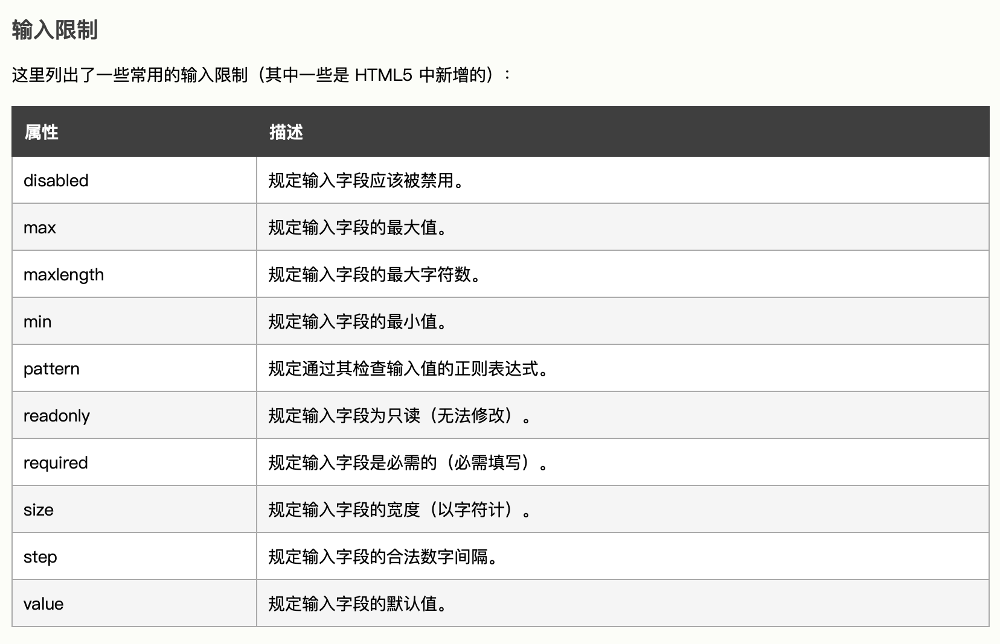

# 基础（四个标签）

```html
<h1></h1>
<h2></h2>
...
<h6></h6>

<p></p>
<a></a>

```

# 样式

## style属性

```html
<!-- 背景颜色 -->
<body style="background-color:yellow"></body>

<!-- 字体 颜色 尺寸 -->
<p style="font-family:arial;color:red;font-size:20px;">A paragraph.</p>


```

# 链接

```html
<!-- 链接 跳转到页面 -->
<a href="http://www.w3school.com.cn/">Visit W3School</a>

<!-- target 定义被链接的文件在何处显示 -->
<!-- 在新窗口打开页面 -->
<a href="http://www.w3school.com.cn/" target="_blank">Visit W3School!</a>

<!-- name属性  -->
<a name="label">锚（显示在页面上的文本）</a>

<!-- 命名和链接  -->
<a name="tips">基本的注意事项 - 有用的提示</a>
<a href="#tips">有用的提示</a>
```

# 图像

```html
<!-- 设置背景图片 -->
<body background="/i/eg_background.jpg"></body>

<!-- 设置图片在文本中的位置 -->
<h2>未设置对齐方式的图像：</h2>
<p>图像  在文本中</p>
<h2>已设置对齐方式的图像：</h2>
<p>图像  在文本中</p>
<p>图像  在文本中</p>
<p>图像  在文本中</p>
<p>请注意，bottom 对齐方式是默认的对齐方式。</p>

<!-- 浮动图片 -->
<p>
 
带有图像的一个段落。图像的 align 属性设置为 "left"。图像将浮动到文本的左侧。
</p>

<!-- 图片大小 -->


<!-- 图片替换文本 -->


<!-- 图片作为链接 -->
<a href="/example/html/lastpage.html">

</a>
```

### 图像映射

```html


<map name="planetmap" id="planetmap">

<area
shape="circle"
coords="180,139,14"
href ="/example/html/venus.html"
target ="_blank"
alt="Venus" />

<area
shape="circle"
coords="129,161,10"
href ="/example/html/mercur.html"
target ="_blank"
alt="Mercury" />

<area
shape="rect"
coords="0,0,110,260"
href ="/example/html/sun.html"
target ="_blank"
alt="Sun" />

</map>
```

# 表格

```html
<table border="1">
<tr>
<th>Heading</th>
<th>Another Heading</th>
</tr>
<tr>
<td>row 1, cell 1</td>
<td>row 1, cell 2</td>
</tr>
<tr>
<td>row 2, cell 1</td>
<td>row 2, cell 2</td>
</tr>
</table>
```

https://www.w3school.com.cn/html/html_tables.asp

# 列表

```html
<h4>Disc 项目符号列表：</h4>
<ul type="disc">  //circle/square
 <li>苹果</li>
 <li>香蕉</li>
 <li>柠檬</li>
 <li>桔子</li>
</ul>  
```

# 内联框架

```html
<iframe src="URL"></iframe>
<iframe src="demo_iframe.htm" width="200" height="200" frameborder="0"></iframe>
```

# 表单

### 文本输入

```html
<input type="text">
```

### 单选

```html
<input type="radio">
```

### 提交按钮

```html
<input type="submit">
```

### Method 属性

```html
<form action="action_page.php" method="GET">
```

### name属性

如果要正确地被提交，每个输入字段必须设置一个 name 属性。

```html
<input type="text" name="lastname" value="Mouse">
```

### 下拉列表

```html
<select name="cars">
<option value="volvo">Volvo</option>
<option value="saab">Saab</option>
<option value="fiat">Fiat</option>
<option value="audi">Audi</option>
</select>

<!-- 预选择 -->
<option value="fiat" selected>Fiat</option>
```

### button元素

```html
<button type="button" onclick="alert('Hello World!')">Click Me!</button>
```

## 关于输入

### 输入类型

#### text, password, submit, 

#### radio

Radio buttons let a user select ONLY ONE of a limited number of choices

#### checkbox

复选框允许用户在有限数量的选项中选择零个或多个选项。

#### botton

#### date

#### color

根据浏览器支持，颜色选择器会出现输入字段中。

#### range

根据浏览器支持，输入字段能够显示为滑块控件。



### input 属性

#### value

*value* 属性规定输入字段的初始值

#### readonly, disabled

#### size, maxlength

#### autocomplete

当自动完成开启，浏览器会基于用户之前的输入值自动填写值。

**提示：**您可以把表单的 autocomplete 设置为 on，同时把特定的输入字段设置为 off，反之亦然。

#### novalidate

如果设置，则 novalidate 规定在提交表单时不对表单数据进行验证。

#### form

form 属性规定 <input> 元素所属的一个或多个表单