# Topic 1  Intro

#### - cost

- 软件高于硬件 on a PC
- cost more to maintain than develop
- SE is concerned with cost-effective software development.

#### - Failure原因

- Increasing system complexity
- Failure to use SE method

### Professional software development

- **What is software?**

  Computer programs and associated documentation.

- **What are the attributes of good software?**

  - deliver the required functionality and performance to the user.
  - be maintainable.
  - dependable and usable

- **What is software engineering?**

  SE is an engineering **discipline** that is concerned with all aspects of software production.

- **What are the fundamental software engineering activities?**

  - *specification*: **define**
  - *development*: **design and program**
  - *validation*: **check**
  - *evolution*: **modify**
  - **Cost**
    - 60% development, 40% testing.

  ------

- **What is the difference between software engineering and computer science?**

  Computer science focuses on theory and fundamentals; SE is concerned with the practicalities of developing and delivering useful software.

- **What is the difference between software engineering and system engineering?**

  System Engineering is concerned with all aspects of computer-based systems development including hardware, software and process engineering. Software Engineering is part of this more general process.

- **What are the best software engineering techniques and methods?**  没有最好的

  Different techniques are appropriate for different types of system. You can’t,therefore, say that one method is better than another.

- **What differences has the web made to software engineering?**

  led to the availability of software services, the possibility of developing highly distributed service based systems.

  led to important advances in programming languages and software reuse.

#### - Products

- Generic products：specification由开发者自己决定
- Customized Poducts：specification由客户决定

#### - Essential attributes of good software

- Maintainability（可维护性）: a critical attribute. *to meet the changing needs of customers.*
- Dependability and security （可依赖性和安全性）:
  - 可依赖性：包括*reliability, security and safety. Dependable software should not cause physical or economic damage in the event of system failure.*
- Efficiency：包括 *responsiveness, processing time, memory utilisation, etc.*
- Acceptability（可接受性）：*must be understandable, usable and **compatible with other systems that they use.***

#### - 定义（关键词）

- **Engineering discipline**

  *Using appropriate theories and methods to solve problems bearing in mind organizational and financial constraints.*

- **All aspects of software production**

  *Not just technical process of development. Also project management and the development of tools, methods etc. to support software production.*

#### - 4个影响软件的问题

- **Heterogeneity** 异构性

  *different system, different type of computer and mobile devices.*

- **Business and social change**

- **Security and trust**

- **Scale**

  *Software has to be developed across a very wide range of scales*

#### - SE diversity

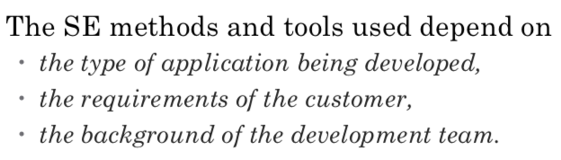

- *Stand-alone applications*
- *Interactive transaction-based applications*
- *Embedded control systems: **数量比其他都多***
- *Batch processing systems*
- *Entertainment systems*
- *Systems for modeling and simulation*
- *Data collection systems*
- *Systems of systems*

#### *- Web-based SE*

- *Software reuse*
- *Incremental and agile development*
- *Service-oriented systems*
- *Rich interfaces*

### *Software engineering ethics*

- *Confidentiality（机密性）*
- *Competence: 不接受超过自己能力范围的工作*
- *Intellectual property rights*
- *Computer misuse：不滥用他人计算机*

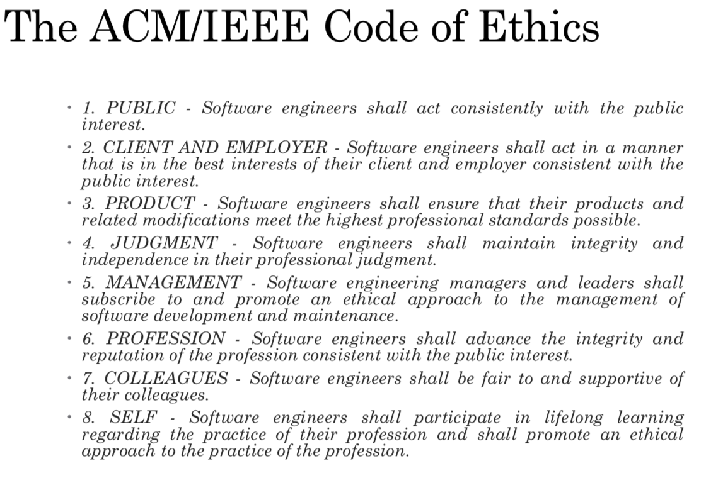

### *Case studies*

# Topic2 Software Processes 软件工程

**Process descriptions may also include:**

- Products：产生了什么
- Roles：哪些人
- Pre and post-conditions：影响活动的前置或后置条件

**Plan-driven process**

**agile process**

大多实际开发过程两个都包括

### Software process models

**an abstract representation of a process.**

##### - Waterfall model（瀑布模型）: Plan-driven model. 各阶段分开

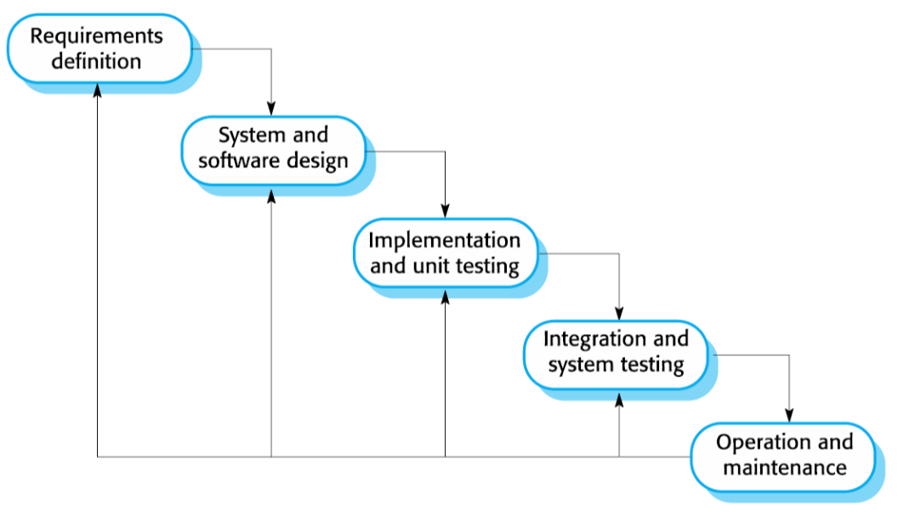

缺点：

- Difficulty to change
- 必须一个阶段结束进行下一阶段

问题：

- 难以适应用户需求的改变
- 适用于大型系统工程：1. 嵌入式系统：软件必须与硬件连接交互， 2. 关键性系统：对安全性和信息安全进行全面分析， 3. 大型软件系统：多家企业共同开发

##### - Incremental development（增量式开发）：*Specification, development and validation are interleaved. May be plan-driven or agile.*

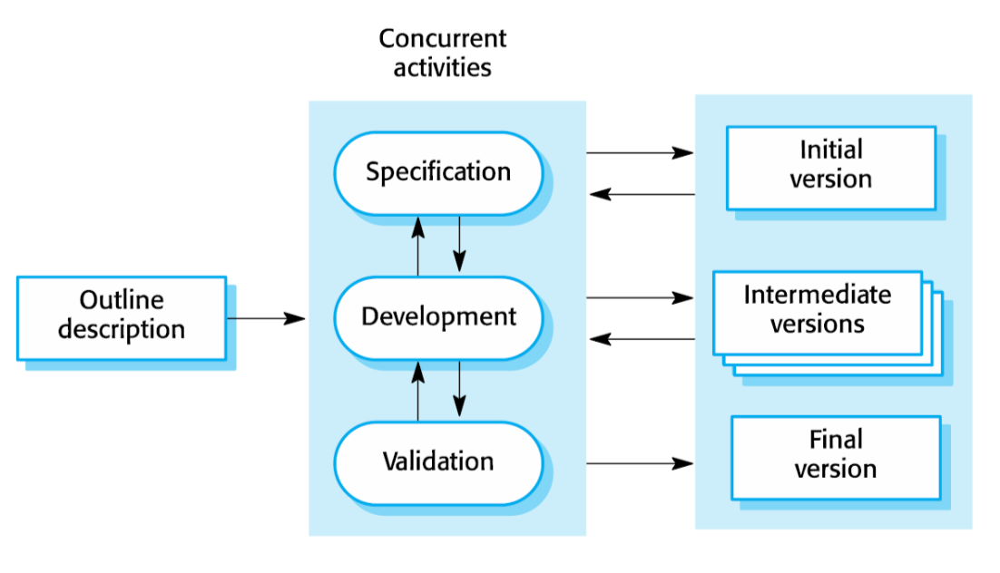

- 计划驱动的增量式开发：增量是提前确定的
- 敏捷的增量式开发：早期的增量确定，后面的增量取决于进度和客户优先级

**Benefits:**

- 降低实现需求变更的成本
- 开发过程中更容易得到客户对于已完成工作的反馈
- 可以更快速地交付和部署有用的软件：已做完的部分可以先进行部署。

**Problems**:

- 过程不可见
- 随着增量的添加，系统结构会逐渐退化。建议定期进行重构。

##### - Integration and configuration（集成和配置）: *The system is assembled from existing configurable components.  （依赖于开复用的构件或系统）May be plan-driven or agile.*

**Types of reusable SW**

- Stand-alone application systems (sometimes called COTS (Commercial-off-the-shelf)) that are configured for use in a particular environment.（通用系统，但要进行调整和适配）
- Collections of objects that are developed as a package to be integrated with a component framework such as .NET or J2EE. （构件、包）
- Web services that are developed according to service standards and which are available for remote invocation.（Web服务）

**Reuse-oriented SE**

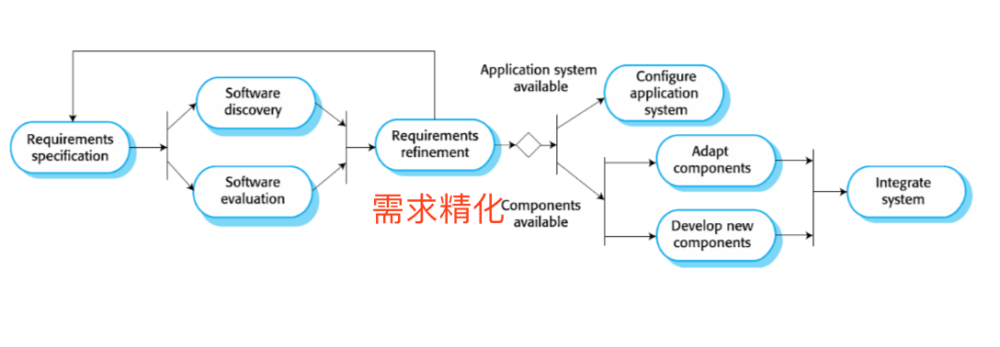

优缺点：

- 降低成本和风险
- 更快开发和交付
- 可能导致系统不完全满足用户的真实需求
- 失去对系统构建演化的控制

### Process activities

##### - Requirements engineering process

##### - Design and implementation

- **design**

- **activities**

  - Architectural design
  - Database design
  - Interface design
  - Component selection and design

- **Implementation**

  Design and implementation交叉进行

  Programming是个人化活动，没有标准

  Debugging是找出错误并修正

##### - Validation （又叫verification and validation验证是否符合specification和是否符合requirements of system customer）

**Testing is the most commonly used V&V activity.**

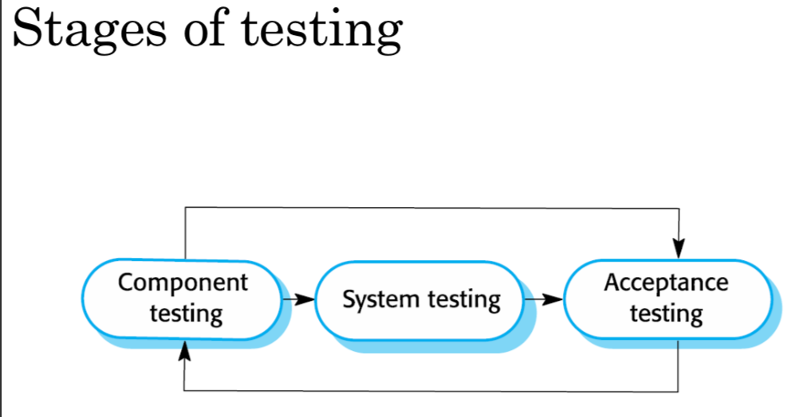

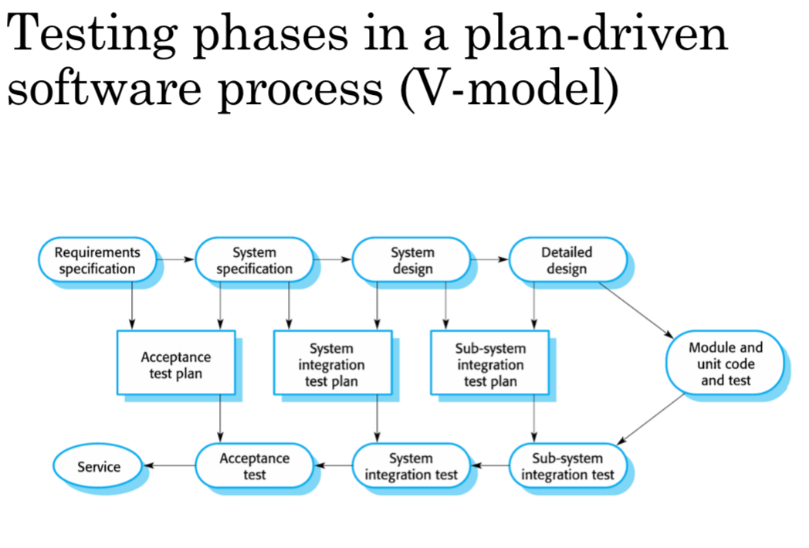

##### - SW evolution

SW flexible and can change

现在很少有软件系统是全新的，开发和维护更像是连续的过程。

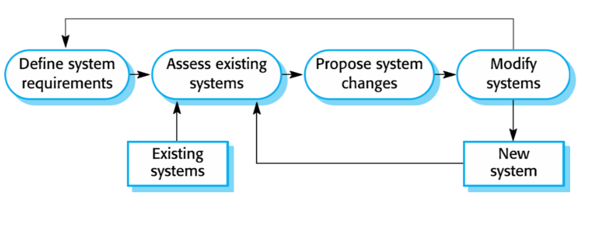

### Coping with change

**Costs of change**:

- Rework
- Costs of implementing new functionality

**降低Rework成本的方法**：

- **Change anticipation （需求预测）**
- **Change tolerance（需求容忍）** 

##### **两种应对变化的方法**：

##### - System prototyping

*This approach supports change anticipation.*

**Protype**: an initial version of a system used to demonstrate concepts and try out design options

**可以被用在**：

- requirements engineering process to help with requirements elicatation and validation
- design processes to explore options and develop a UI design
- testing process to run back-to-back tests

**优点：**

- Improved system usability
- A closer match to users' real needs
- Improved design quality
- Improved maintainability
- Reduced development effort

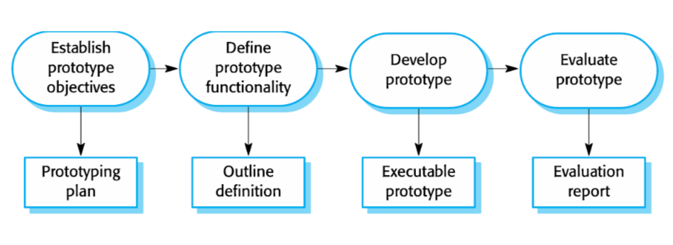

**Prototype development**:

- May be based on rapid prototyping languages or tools
- May involve leaving out functionality

**Throw-away prototypes**

Prototypes should be **discarded after development** as they are not a good basis for a production system.

##### - Incremental delivery

*This supports both change avoidance and change tolerance.*

- 开发过程被分成不同的增量
- User requirements are prioritized: 优先级最高的需求即为最优先的增量

一旦某个增量开始开发，需求就被冻结，但之后的增量还可以改变

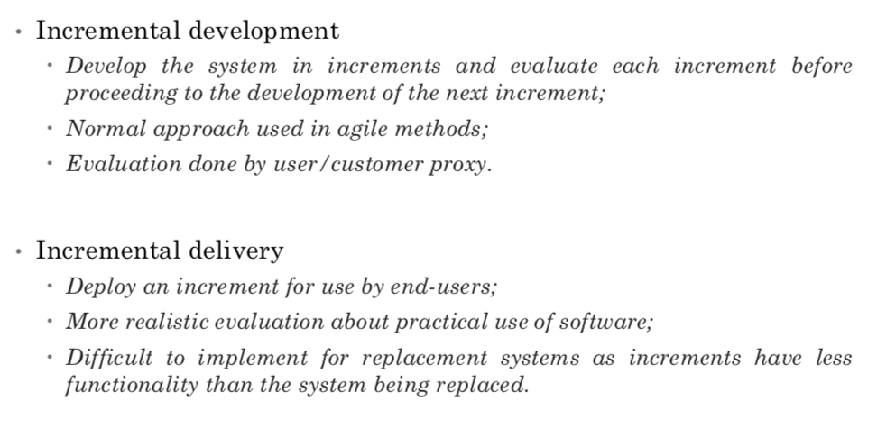

**增量开发和增量交付：增量交付始终有可用的版本和功能**

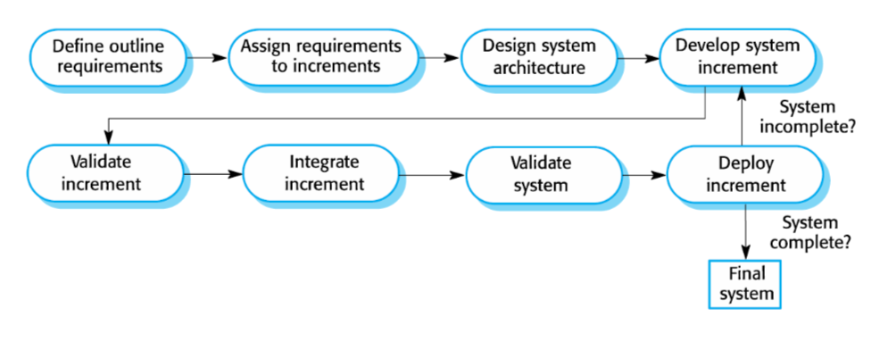

**优点：**

- Customer value can be delivered with each increment so system functionality is available earlier.
- Early increments act as a prototype to help elicit requirements for later increments.
- Lower risk of overall project failure.
- The highest priority system services tend to receive the most testing.

**问题**

- Most systems require a set of basic facilities that are used by different parts of the system.（在增量开始实现前，需求并没有详细定义，很难确定common facilities that are needed by all increments）
- The essence of iterative processes is that the specification is developed in conjunction with the software.（与许多组织的采购方式冲突，通常规格说明也是系统开发合约的一部分，但增量式开发直到最终增量需求确定前都没有完整的系统规格说明，大客户可能无法接受）

### Process improvement

*A way of enhancing the quality of their software, reducing costs or accelerating their development processes.*

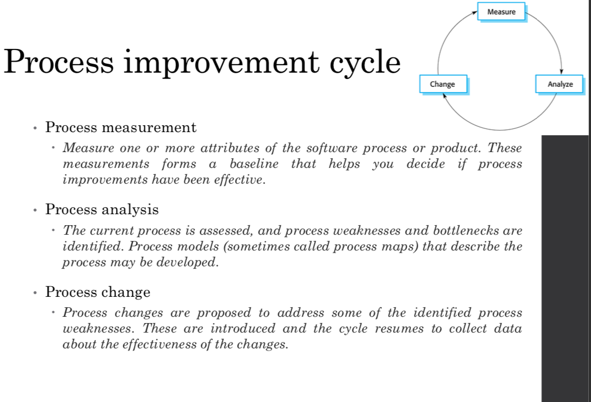

**方法：**

- **The process maturity approach**

 *Focuses on improving process and project management and introducing good software engineering practice.*

- **The agile approach**

*The primary characteristics of agile methods are rapid delivery of functionality and responsiveness to changing customer requirements.*

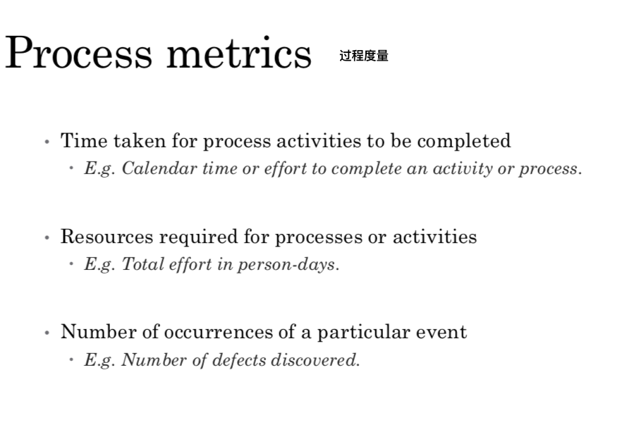

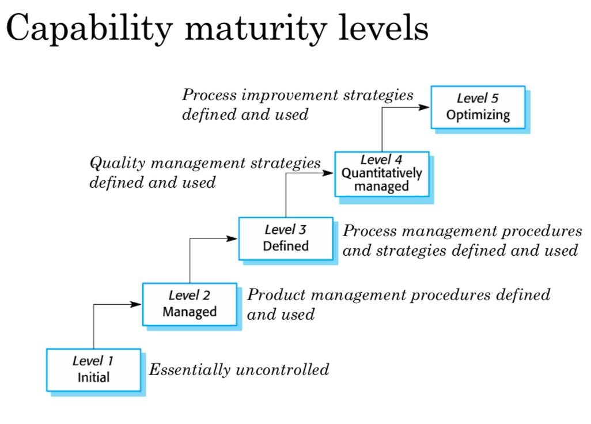

### Review

#### CH1

- **软件工程是一门覆盖软件生产的各个方面的工程学科**

- 软件不仅是程序，还包括系统用户、质量保证人员以及开发者所需要的所有电子文档。

  **软件产品的基本属性是可维护性、可依赖性、安全信息姓、效率以及可接受性。**

- **软件过程包括软件开发过程中所涉及的所有活动。****软件规格说明、开发、确认和演化这些高层活动是所有软件过程中的一部分。**

- 世界上存在很多不同类型的系统。每一种类型的系统的开发都需要一种与之相适应的软件工程工具和技术。几乎不存在适用于所有类型的系统的软件设计和实现技术。

- 软件工程的基本思想适用于所有的软件系统。**这些基本思想包括受管理的软件过程、软件的可依赖性和信息安全性、需求工程和软件复用。**

- 软件工程师对软件工程行业和整个社会负有责任，不应该只关心技术问题，而应该对影响他们工作的到的问题有所知晓。

- 职业协会发布的行为准则定义了到的和职业标准。这些准则为协会成员设定了所期望的行为标准。

#### CH2

- **软件过程是生产一个软件系统过程中所包含的一系列活动。软件过程模型是这些过程的抽象表示。**
- 通用过程模型描述软件过程的组织。这些通用过程模型的例子包括**瀑布模型、增量式开发、可复用构建配置与集成等。**
- 需求工程是开发软件规格说明的过程。规格说明的目的是向开发者传达客户方对于系统的需要。
- **设计和实现过程是将需求规格说明转换为一个可运行的软件系统的过程。**
- **软件确认是检查系统是否符合他的规格说明以及是否符合系统用户的真实需要的过程。**
- **软件演化发生在修改已有的软件系统以满足新的需求的时候。**变化是持续的，软件必须演化以保持有用性。
- **过程应该包含应对变化的活动。**可能包含一个**原型构造**阶段，这回有助于避免在需求和设计上的错误决策。过程可以**按照迭代化开发和交付进行组织**，这样变更可以在不影响系统整体的情况下进行。
- **过程改进是改进现有的软件过程以提高软件质量、降低开发成本、缩短开发时间的过程。过程改进是一个循环式的过程，包括过程度量、分析、和改变。**

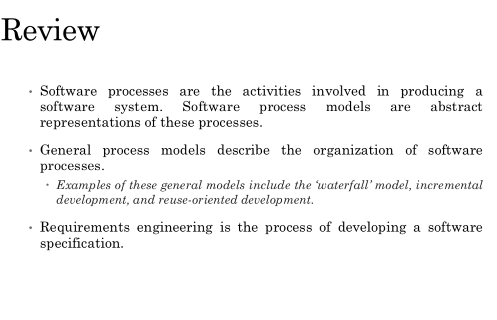

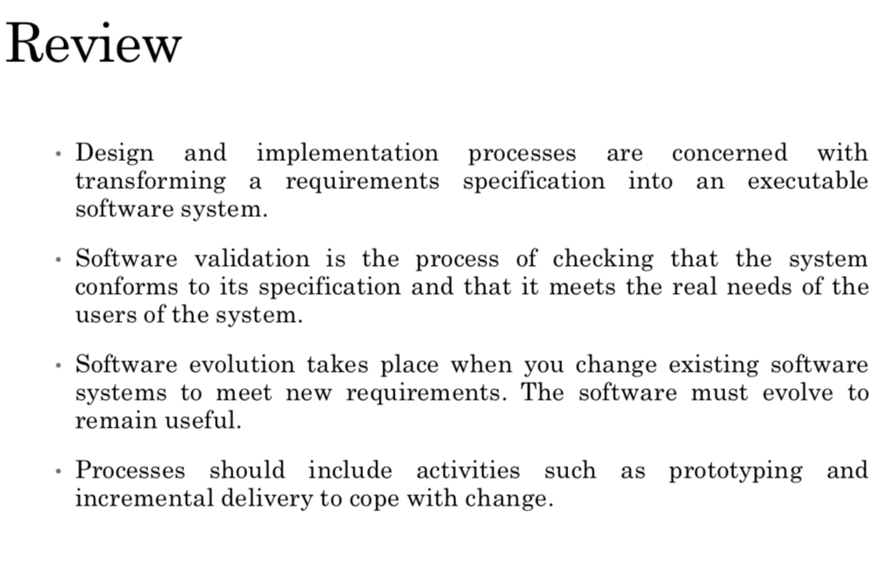

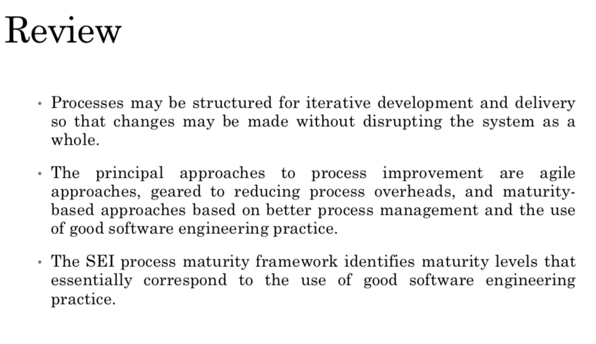

